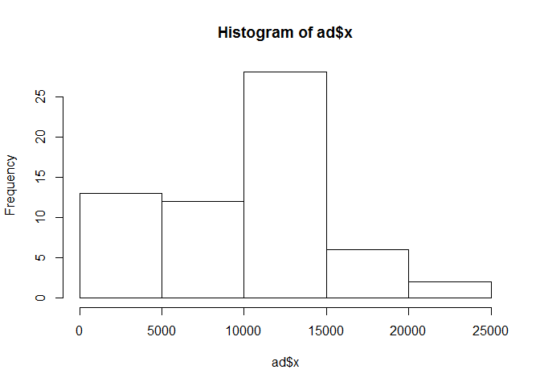
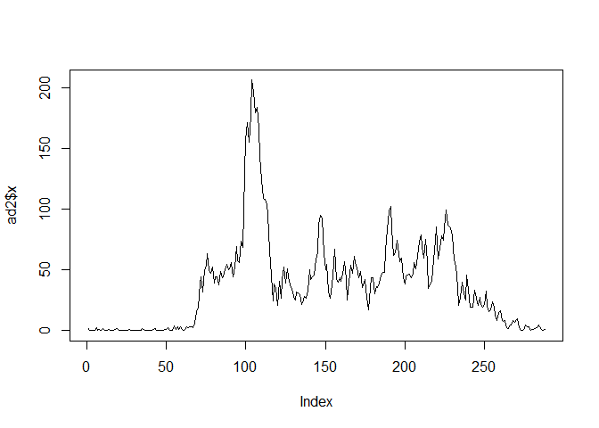
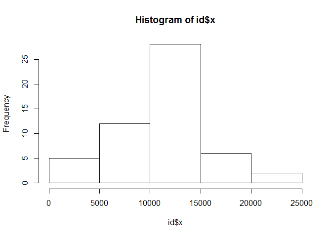
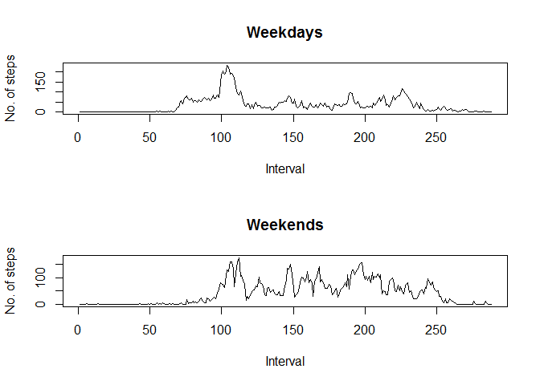

# Reproducible Research Assignment 1
Abhijit K  
Monday, August 18, 2014  

Part 1:


```r
d<-read.csv('activity.csv')
ad<-aggregate(d$steps, by=list(date=d$date), sum, na.rm=TRUE)
hist(ad$x)
```

 

```r
mean(ad$x)
```

```
## [1] 9354
```

```r
median(ad$x)
```

```
## [1] 10395
```

```r
ad2<-aggregate(d$steps, by=list(interval=d$interval), mean, na.rm=TRUE)
plot(ad2$x, type="l")
```

 

```r
ad2[ad2$x==max(ad2$x),]
```

```
##     interval     x
## 104      835 206.2
```

Impute missing values

```r
ad3<-aggregate(d$steps, by=list(date=d$date),mean, na.rm=TRUE)
d2<-d
d2$steps[d2$steps=="NA"]<-mean(ad$x)
id<-aggregate(d2$steps, by=list(date=d2$date), sum, na.rm=FALSE)
hist(id$x)
```

 

```r
mean(id$x)
```

```
## [1] NA
```

```r
median(id$x)
```

```
## [1] NA
```

```r
diffmean<-mean(id$x)-mean(ad$x)
diffmedian<- median(id$x) - median(ad$x)
```
Add a weekend factor to revised dataset


```r
d2$wend<-as.factor(ifelse(weekdays( as.POSIXlt(d2$date)) %in% c("Saturday","Sunday"), "Weekend", "Weekday")) 
d2week<-d2[d2$wend=="Weekday",]
d2weekend<-d2[d2$wend=="Weekend",]
ad4<-aggregate(d2week$steps, by=list(interval=d2week$interval), mean, na.rm=TRUE)
ad5<-aggregate(d2weekend$steps, by=list(interval=d2weekend$interval), mean, na.rm=TRUE)
par(mfrow=c(2,1))
plot(ad4$x, main="Weekdays", 
  xlab="Interval", ylab="No. of steps",type="l")
plot(ad5$x, main="Weekends", 
  xlab="Interval", ylab="No. of steps",type="l")
```

 
